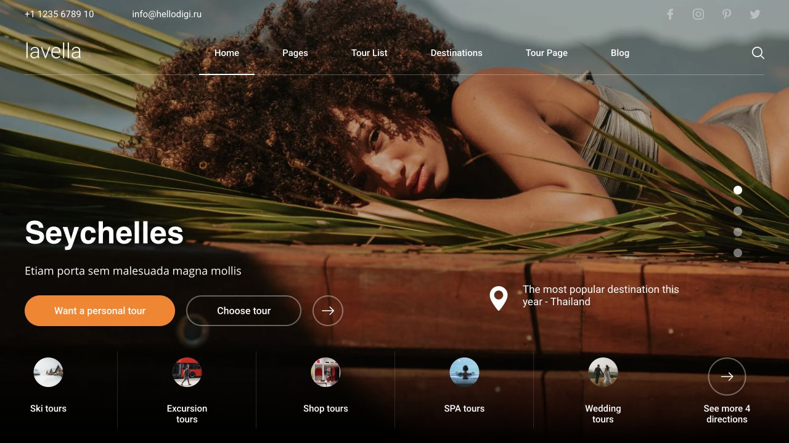
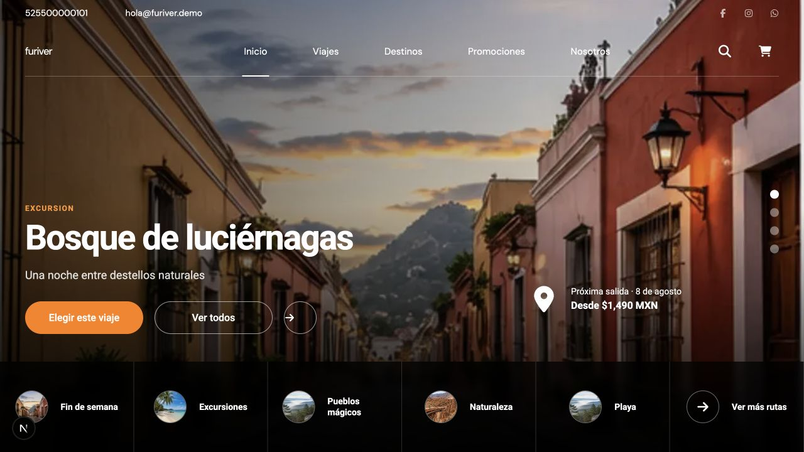
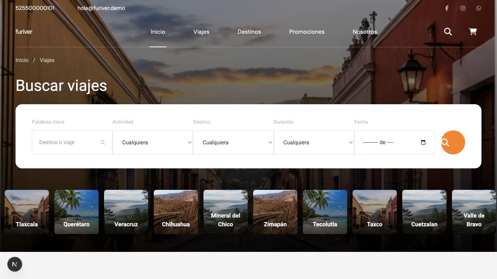
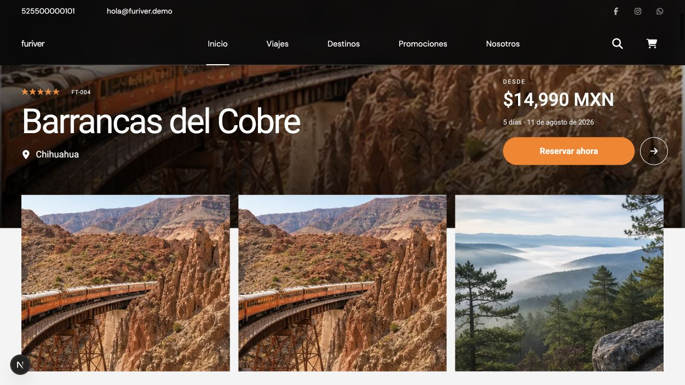

# Comparación visual final

Las imágenes se capturaron con el navegador integrado a 1280 × 720. Cada par
usa la página exacta del ZIP y la ruta equivalente de Fu Travel OS.

## Home desktop

| Lavella original | Fu Travel OS Lavella |
| --- | --- |
|  |  |

Coincidencias verificadas: header de dos niveles, hero de viewport completo,
título compacto inferior izquierdo, CTAs en píldora, callout derecho, dots
verticales y franja inferior de categorías.

## Listado desktop

| Lavella original | Fu Travel OS Lavella |
| --- | --- |
|  |  |

Coincidencias verificadas: hero interior fotográfico, breadcrumb, título,
buscador blanco de gran formato y tira inferior de destinos.

## Detalle desktop

| Lavella original | Fu Travel OS Lavella |
| --- | --- |
|  |  |

Coincidencias verificadas: metadata sobre fotografía, título y ubicación a la
izquierda, precio/CTA a la derecha y galería de tres columnas superpuesta al
borde inferior del hero.

## Recorridos completos

- [Home original](../original/original-home-full.png)
- [Home final](../after/after-home-full.png)
- [Detalle original](../original/original-tour-detail-full.png)
- [Detalle final](../after/after-tour-detail-full.png)

## Evaluación interna de fidelidad

| Bloque | Calificación |
| --- | ---: |
| Estructura general | 9/10 |
| Header | 9/10 |
| Hero | 9/10 |
| Tipografía | 8/10 |
| Paleta | 9/10 |
| Cards | 8/10 |
| Espaciado | 8/10 |
| Detalle | 8/10 |
| Footer | 8/10 |
| Responsive (por reglas CSS auditadas) | 8/10 |

Limitación de captura: la sesión de navegador integrada disponible en esta
ejecución está fijada a 1280 × 720 y no admite modificar el viewport. Por ello
las variantes móviles se validaron mediante breakpoints, DOM y estilos, pero no
se presenta una captura móvil simulada como si fuera una captura auténtica.
