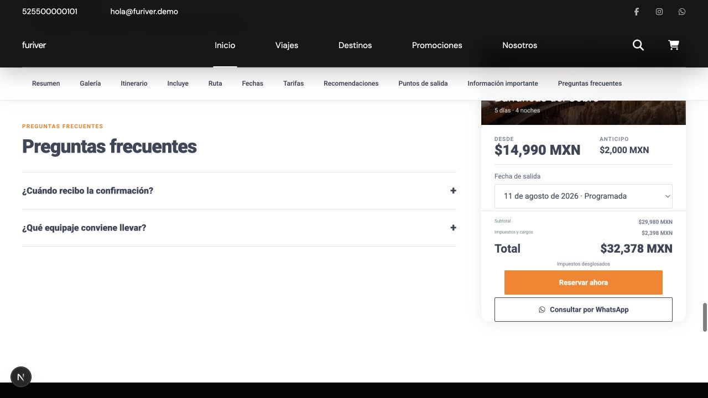
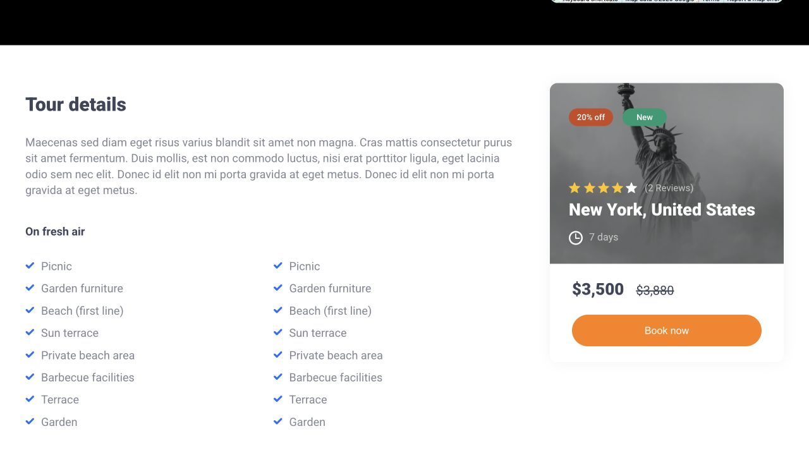
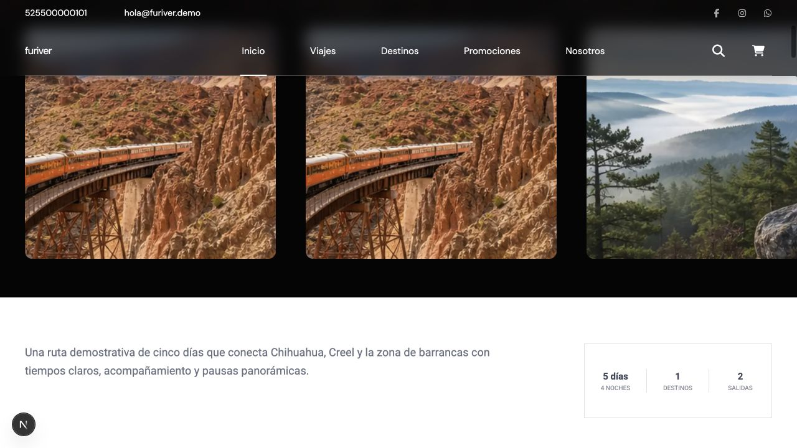
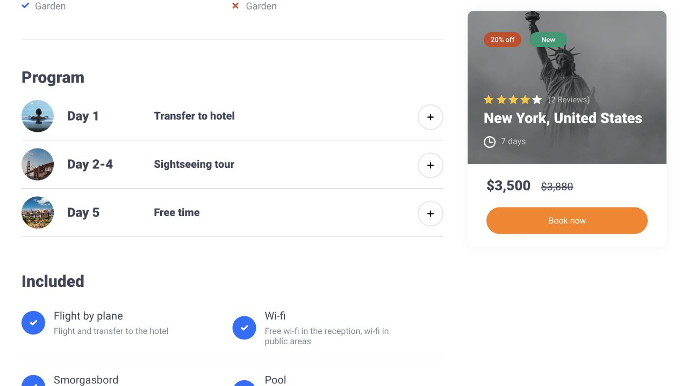
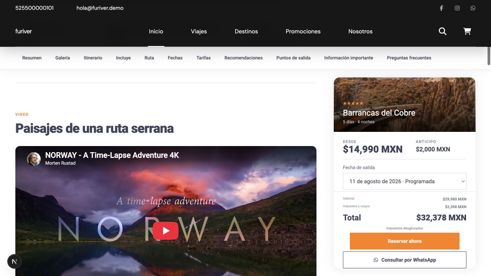

# Comparación final de `single.html`

Referencia: `reference-themes/lavella-extracted/HTML/single.html`.

Viewport disponible para captura: 1280 × 720.

## Hero y galería

| Original | Implementación final |
| --- | --- |
|  |  |

La implementación final conserva el header superpuesto, breadcrumb, rating,
título compacto de peso 900, ubicación, CTA y controles alineados. La galería
usa el mismo patrón horizontal de tarjetas grandes, radios moderados y
desbordamiento controlado.

## Cuerpo y sidebar

| Original | Implementación final |
| --- | --- |
|  |  |

La relación desktop se ajustó a 785/370 px con 45 px de separación, equivalente
al breakpoint de 1400 px del template. El panel combina cabecera fotográfica y
cuerpo blanco, y permanece sticky a 202 px bajo header y navegación.

## Itinerario

| Original | Implementación final |
| --- | --- |
|  |  |

Las filas mantienen 90 px, marcador circular, jerarquía día/título, borde
inferior y control circular. React conserva desplegar/contraer, horarios,
paradas, alimentos, hospedaje, destacados e imágenes.

## Páginas completas

- [Original completo](original-single-full.png)
- [Implementación anterior](implementation-before-full.png)
- [Implementación final](implementation-after-full.png)

## Responsive

La sesión del navegador integrada estaba fijada a 1280 × 720 y no admite cambio
de viewport. Por esa razón no se generaron `original-single-mobile.png` ni
`after-single-mobile.png`: producirlas mediante escalado habría sido una captura
falsa. El comportamiento móvil se verificó en CSS/DOM:

- apilado por debajo de 1000 px;
- carrusel horizontal táctil;
- hero flexible;
- navegación horizontal sticky a 68 px;
- áreas táctiles mínimas;
- barra inferior oculta mientras el hero es visible;
- bottom sheet con foco, Escape, scroll interno y safe area;
- una columna en itinerario, incluidos, fechas y tarifas.

## Calificación de fidelidad

| Bloque | Calificación |
| --- | ---: |
| Estructura general | 9/10 |
| Hero | 9/10 |
| Galería | 9/10 |
| Título y metadata | 9/10 |
| Navegación | 8/10 |
| Cuerpo y sidebar | 9/10 |
| Itinerario | 9/10 |
| Panel de reserva | 8/10 |
| Footer | 8/10 |
| Responsive | 8/10 |

Las diferencias restantes son deliberadas: el panel incorpora reglas modernas
de viajeros, impuestos, capacidad y anticipo que no existían en el HTML de
2019; el mapa permanece como representación demo segura.
